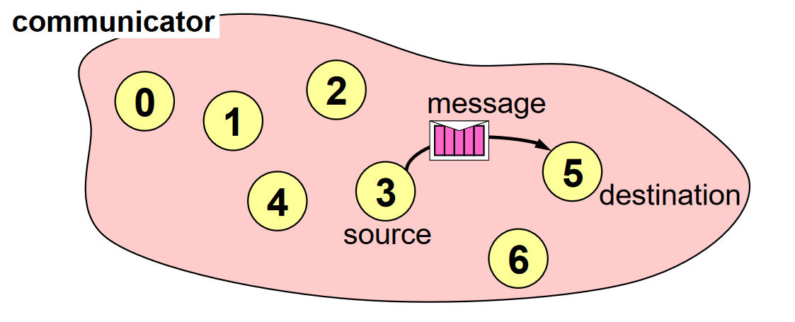

Point to point communication
============================

This is the simplest form of message passing, where one process sends message to another. 
Although, this can be of two types, namely synchronous and asynchronous. 

The important thing to note here is that the communication between two process takes place within a communicator. 
The source process sends message to the destination process. While processes are identified by their ranks in the communicator.

.. code-block:: python
    
    from mpi4py import MPI
    import numpy
    comm = MPI.COMM_WORLD
    rank = comm.Get_rank()
    if rank == 0:
        data = {'a': 7, 'b': 5.5}
        comm.send(data, dest=1)
    elif rank == 1:
        data = comm.recv(source=0)
        print('On process 1, data is ',data)

In this example, a dictionary object ``data`` is transmitted from rank 0 to rank 1, performed by the ``comm.send`` command.

.. py:function:: comm.send(obj, dest, tag)

   Sends obj to dest. With a tag (piggyback information) transfered with the data. 

   :param obj: Any python object that can be serialized with the pickle method. 
   :param dest: int
   :param tag: int
   :rtype: None

.. py:function:: comm.recv(source, tag)

   Recievs obj from source.

   :param source: int
   :param tag: int
   :rtype: Any

Any such object such as a string, integer or a Numpy array can be send this way. 
It should also be noted that ``send`` is compatible with ``recv`` and same is observed between ``Send`` and ``Recv``.

For a successful point-to-point communication, 

1. Sender must specify a valid destination rank.
2. Reciever must specify a valid source rank. 
3. Communicator must be same. 
4. Sending and recieving data type should match.
5. Sending and recieving tags must also match [1]_. 

.. rubric:: Footnotes

.. [1] Although keeping different tags is possible, known as wildcarding.

Read about other MPI functions `here <https://mpi4py.readthedocs.io/en/stable/reference/mpi4py.MPI.Comm.html?highlight=send(>`_.

