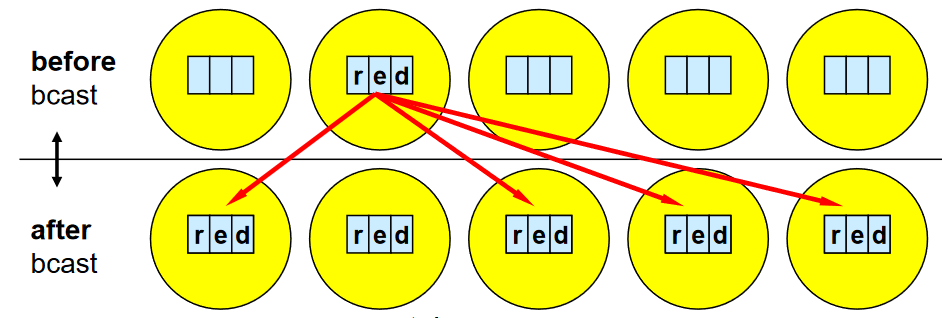

Broadcast
=========

This type falls in the collective mode of communication where a data source is transferred to all processes (ranks) in a communicator. Just like the following image. 

In the following example, a string variable ``data`` is broadcasted from rank 0 to all the other ranks within the communicator. 

.. code-block:: python

    from mpi4py import MPI

    comm = MPI.COMM_WORLD
    rank = comm.Get_rank()

    if rank == 0:
        data = ['r','e','d']
        
    else:
        data = None

    data = comm.bcast(data, root=0)
    print('Rank: ',rank,', data: ' ,data)

Broadcasting involves sending data to all processes (ranks) in a communicator. For instance, in the image above has the data variable in rank 1, and after broadcast , it is sent to all the other ranks within the communicator. 

.. py:function:: comm.bcast(obj, root=0)
    Broadcasts obj from root.

   :param obj: Any
   :param root: int
   :rtype: Any