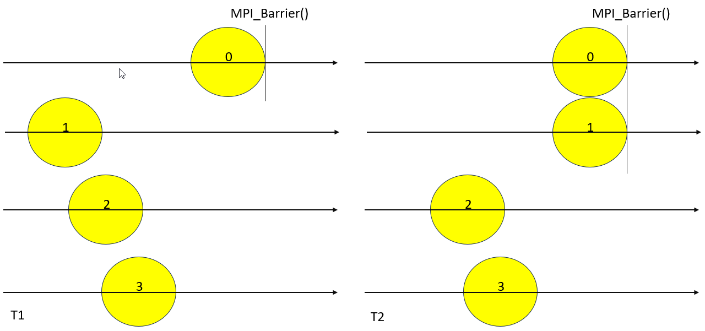
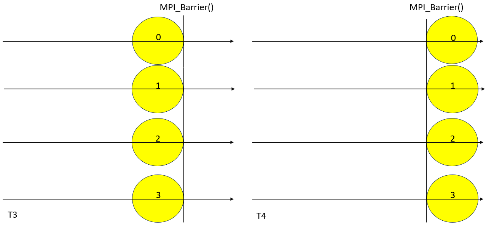

Barrier
=======

Barrier is used to synchronize processes during collective communication. It does this by making sure that each step has a barrier that no rank can pass until all ranks finish the same step. Once it does ranks are allowed to progress to the next step. See the diagram below:

.. code-block:: python

    from mpi4py import MPI
    from time import sleep
    import random

    comm = MPI.COMM_WORLD
    rank = comm.Get_rank()

    if rank == 0:
        sleep(2)
        print("head finished sleeping")

    comm.Barrier()

    sleep(random.uniform(0, 2))
    print(rank, 'finished sleeping ')

    comm.Barrier()

    if rank == 0:
        print("All done!")

Consider the image above where ranks 0 is ahead of ranks 1-3 at T1. At T2, this changes with ranks 1 also reaching the barrier. 

Now in T3, all the ranks have reached the barrier, only after which they cross it as indicated in T4. 