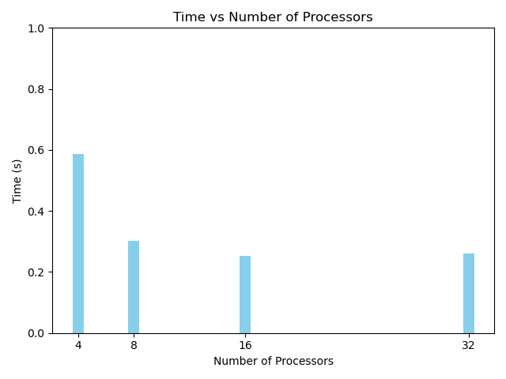

Example: Calculation of pi
==========================

So far only simple examples were shown to introduce few of the basic concepts. In this example, a real world example is shown on how MPI parallelism can help speed up the code. 

.. code-block:: python

    from mpi4py import MPI
    import time
    import math

    t0 = time.time()

    comm = MPI.COMM_WORLD
    rank = comm.Get_rank()
    nprocs = comm.Get_size()

    # number of integration steps
    nsteps = 10000000
    # step size
    dx = 1.0 / nsteps

    if rank == 0:
        # determine the size of each sub-task
        ave, res = divmod(nsteps, nprocs)
        counts = [ave + 1 if p < res else ave for p in range(nprocs)]
        print(counts)	
        # determine the starting and ending indices of each sub-task
        starts = [sum(counts[:p]) for p in range(nprocs)]
        ends = [sum(counts[:p+1]) for p in range(nprocs)]

        # save the starting and ending indices in data  
        data = [(starts[p], ends[p]) for p in range(nprocs)]
    else:
        data = None

    data = comm.scatter(data, root=0)

    # compute partial contribution to pi on each process
    partial_pi = 0.0

    print(data[0],data[1])

    for i in range(data[0], data[1]):
        x = (i + 0.5) * dx
        partial_pi += 4.0 / (1.0 + x * x)
    partial_pi *= dx

    partial_pi = comm.gather(partial_pi, root=0)

    if rank == 0:
        print('pi computed in {:.3f} sec'.format(time.time() - t0))
        print('error is {}'.format(abs(sum(partial_pi) - math.pi)))

In the above code, ``t0`` is set to calculate time, ``comm`` is set for the communicator, ``rank`` is set to be the rank in the communicator and ``size`` is set to be the size of communicator. 

Integration steps assigned are 10,000,000 and correspondingly the step size ``dx``. 

Now, if the rank is the first rank in MPI process, then ``ave`` and ``res`` are set using divmod, which takes two numbers as arguments and returns their quotient and remainder in a tuple. 

Next a list ``counts`` is created which iterates over processes ``p`` in range ``nprocs``.

For each value of p, the value in counts is assigned. This value is essentially the number of domains that the calculation occurs. 

On running the job, on say, 4 processors (``--ntasks-per-node`` flag), the counts can be seen as,

``[2500000, 2500000, 2500000, 2500000]``

The next step is to scatter the data from rank 0 to other ranks. 

``data = comm.scatter(data, root=0)``

a ``partial_pi`` variable is then calculated using the discrete steps as follows 

.. code-block:: python

    print(data[0], data[1])
    for i in range(data[0], data[1]):
        x = (i+0.5)*dx
        partial_pi += 4.0 / (1.0 + x*x)
    partial_pi *= dx

    partial_pi = comm.gather(partial_pi, root=0)

At the start and end of the data range on each rank is printed. For values (i) in the range of data, x is calculated to be ``i+0.5`` multiplied by dx, which was computed earlier. 

partial_pi is then increased each step. 
Finally partial_pi after the loop completes is multiplied by dx and then the communicators gathers all of the values of partial_pi back to rank 0, which is the root process. 

The final bit, calculates the error and time to perform the operation. 

The image above shows the time to calculate this value with the help of ``[4,8,16,32]`` processors. As can be seen, that the best result is observed from scaling 4 to 8 processors. And then on, the returns diminish. 