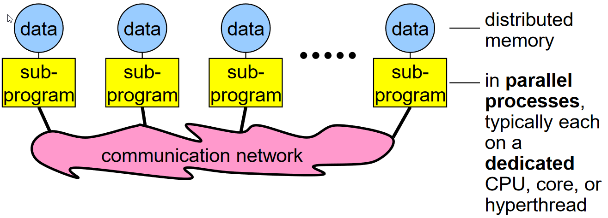

.. mpi4py_documentation documentation master file, created by
   sphinx-quickstart on Mon Feb  5 12:01:15 2024.
   You can adapt this file completely to your liking, but it should at least
   contain the root `toctree` directive.

===============
MPI4Py on ADA
===============

MPI4Py is a python package that uses Message Passing Interface (MPI). MPI is used for multi-node communication for parallel calculations in HPC. 

Using SLURM to ask for more resources does not automatically gaurantee parallel features, as the data still needs to passed between processors, for which MPI is essential. 

Why use MPI?
============

Image reference from Rolf Rabenseifner's course on MPI.

A sequential approach to programming involves data from memory being transferred to a process in a processor. 
While an MPI approach as shown in figure above, can do the same, but in parallel, by "distributing" the memory to parallel processes for various computations. 

Quickstart
==========

The following set of commands set up the conda environment required to run MPI using the MPI4Py package on ADA.
On the login node on ADA, the following steps create an mpi4py environment which will be used to submit jobs on the compute nodes. 

1. Load Anaconda

   ``module load anaconda-uoneasy/x.x``

2. Load gcc as this is required to compile the files. 

   ``module load gcc``

3. Create a new conda environment.

   ``conda create --name mpi4pytest``

   Note that this environment will be created with the default version of python from the available modules. This can be checked with ``python --version``. If a different python version is desired ``--python=3.X.X`` by replacing X with the specific version number. This flag can then be added after ``mpi4pytest`` above. For examples

   ``conda create --name mpi4pytest --python=3.11.2``

4. Activate the created environment. 

   ``source activate mpi4pytest``

5. Install the mpi4py library to the conda environment. 

   ``conda install -c conda-forge mpi4py mpich``

6. Install any other libraries that you may need with your mpi4py work.

   ``Conda install numpy``

7. A sanity check can be performed to see if the MPI4Py installation has been successful. 

   ``mpiexec -n 12 python -m mpi4py.bench helloworld``

This should give you the following result, indicating 12 threads were used. 

All the above has been indicated below together.

.. code-block:: python
   :caption: Creating a conda environment to run MPI4Py on Ada.

   conda create --name mpi4pytest --python=3.11.2
   source activate mpi4pytest
   conda install -c conda-forge mpi4py mpich -y
   conda install numpy -y
   mpiexec -n 12 python -m mpi4py.bench helloworld

Chapters
========

The following examples are discussed in this documentation. These examples can be copied to your ``\home`` directory using the command ``copy_mpi4py_examples``. 

.. toctree::

    01hello
    02p2p
    03broadcast
    04scatter
    05gather
    06barrier
    07picalc    

Submitting a job to ADA
=======================

.. code-block:: bash

   #!/bin/bash

   #SBATCH --partition = defq
   #SBATCH --nodes = 1
   #SBATCH --ntasks-per-node = 12
   #SBATCH --mem=2g ##Change this if job requires higher memory.
   #SBATCH --time = 1:00:00

   moudle load anaconda-uoneasy/
   module load openmpi/gcc/4.1.6

   source activate mpi4pytest ## this conda environment name should the same as what was created.
   
   mpirun -np $SLURM_NTASKS python <pyfilename.py>

The above will run the code on the value assigned to ``--ntasks-per-node`` number of processors. 

Save the above file (say run.slurm) and type the following command in from the same directory where you have the python file pyfilename.py.

``sbatch run.slurm``

The submitted job can be tracked with 

``squeue -lu <user_id>``

.. important::

   An elaborate deep dive for MPI4py is available `here <https://fs.hlrs.de/projects/par/par_prog_ws/pdf/mpi_3.1_rab-animated.pdf>`_. This documentation however, gives basic examples for MPI concepts on ADA, but is also heavily inspired from the course above. 

.. toctree::
   :maxdepth: 2
   :caption: Contents:

Indices and tables
==================

* :ref:`genindex`
